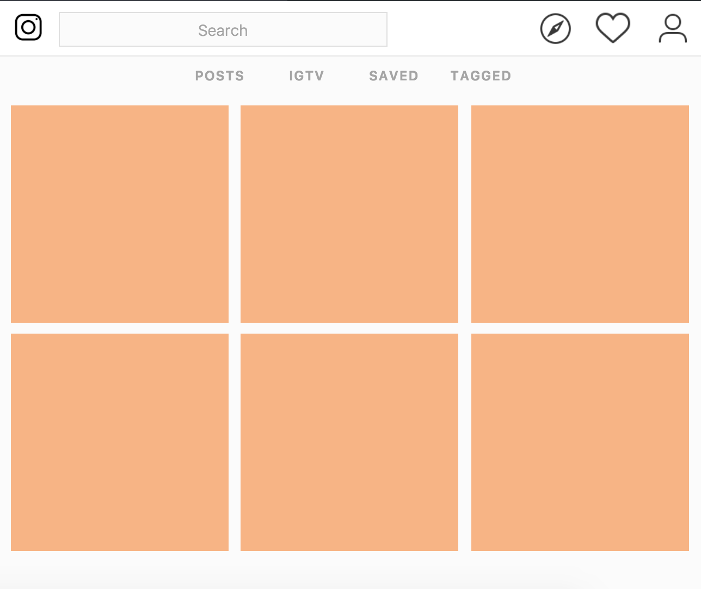
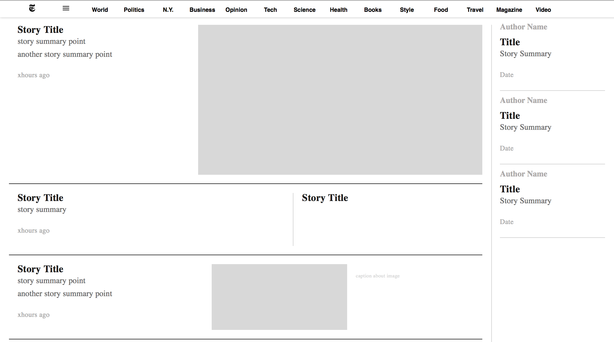

# Mockup Magic

## The Goal
As you saw in the previous lab, CSS grid allows you to create websites that rival some of the most popular web destinations today. Now that you've had some experience with nesting grids, it's time to push those skills even more.

## The Lab
In this lab you'll be given three mockups of popular websites to match. Once again you'll be using CSS grids, and specifically the concept of nesting grids. However, in this lab you won't have any guidance other than the mockup. It's up to you to break up the given html in any way you see fit to get to your final goal. For each mockup you'll be given the appropriate HTML. As you move through the lab the mockups will continue to increase in difficulty. Feel free to add any ids or classes that you think you need and get to styling!

#### Mockup One: Instagram
You'll be using the html in `instagram.html `and adding your own styling to `instagram.css`.

#### Mockup Two: Airbnb
You'll be using the html in `airbnb.html` and adding your own styling to `airbnb.css`.

#### Mockup Three: New York Times
You'll be using the html in `nyt.html` and adding your own styling to `nyt.css`.

#### Stretch
1. Choose your favorite mockup from above, go to the website, and add another element of content to your page. This could be images for Pinterest, CSS hover effects, comments on instagram, or house descriptions on airbnb. Style this added content so that it looks the same way it does on the website!
2. Pick the website that you spend the most time on and create your own mockup based on that page! When you're done show a partner and see if they can guess what website you were modeling your page after.

<!-- Question:
1. images like logos etc. Keep these in the project, do I need to find ones with particular permissions?
2. Opinion for mockup three? personally like nyt the best
3. said to check out lesson plans for css flexbox but where are those?
ideas for flexbox and grid:
https://dri.es/redesigning-a-website-using-css-grid-and-flexbox
general opinion seems to be to use grid for the layout and flex to style the items within the grid.
  * doing a navbar with flex is a good idea bc of how annoying they are with grid

-->
